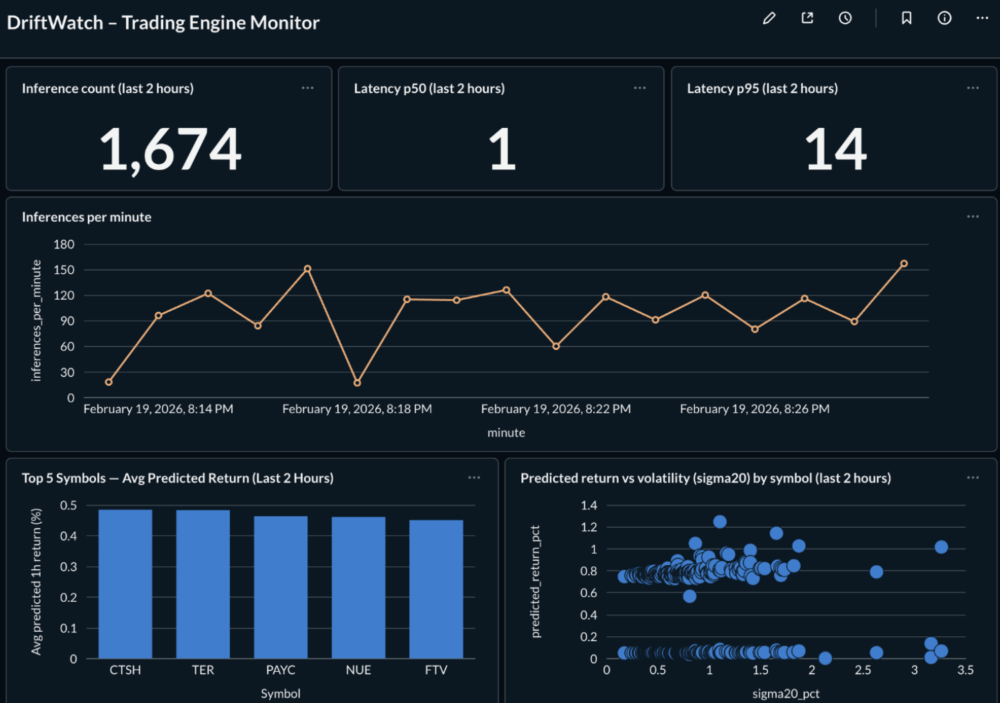

# DriftWatch

DriftWatch is a lightweight observability layer for inference systems. It logs **inference events** (predictions + latency + features + segments) and **label events** (ground truth later) into **Postgres**, then you explore everything in **Metabase** with interactive dashboards.

Trading is just one integration. DriftWatch is designed to be reused across future projects (ML models, agents, routing, fraud, recommenders, etc.).

---

## What DriftWatch tracks

### Inference events

Each event typically includes:

* `model_id`, `model_version`
* `ts` (timestamp)
* `y_pred_num` / `y_pred_text` (prediction output)
* `latency_ms`
* `features_json` (JSON inputs, sanitized so NaN/Inf becomes `null`)
* `segment_json` (tags like env, symbol, timeframe, session, etc.)
* `request_id` (a stable join key to attach labels later)

### Label events

A label arrives later (seconds, minutes, or days later) and attaches to the same `request_id`, for example:

* realized PnL for a trade
* click/no-click
* fraud/not-fraud
* error/timeout label

### Daily metrics

Rollups such as counts, latency percentiles, and other per-day summaries so you can track health over time.

---

## Quickstart (local)

### Requirements

* Docker Desktop (running)
* Python 3.11+ (for the smoke test / SDK)

Start the stack using the repo’s `docker-compose.yml`, then open Metabase:

* [http://localhost:3000](http://localhost:3000)

In Metabase, add the DriftWatch analytics database (`driftwatch`) as a PostgreSQL source so you can browse tables and build dashboards.

Run `smoke_test_driftwatch.py` to insert sample events and verify the pipeline end-to-end (insert → flush → query → JSON sanitization).

---

## Recommended dashboard cards

These cards are simple, high-signal, and work well for a single clean dashboard.

1. **Inferences (last 2 hours)**
   Type: Number
   Meaning: throughput / system activity

2. **Latency p50 (last 2 hours)**
   Type: Number
   Meaning: typical response time

3. **Latency p95 (last 2 hours)**
   Type: Number
   Meaning: tail latency / worst user experience

4. **Inferences per minute (last 2 hours)**
   Type: Line
   Meaning: stability, spikes, downtime visibility

5. **Top segments by volume (last 2 hours)**
   Type: Bar
   Meaning: where load is concentrated (symbol, region, endpoint, etc.)

6. **Prediction vs volatility / feature scatter**
   Type: Scatter
   X-axis: prediction (example: `y_pred_num`)
   Y-axis: key feature (example: `features_json.sigma20_pct`)
   Color: segment key (example: `segment_json.sym`)
   Meaning: sanity-check model behavior across regimes

---

## Repo structure

* `docker-compose.yml` — local Postgres + Metabase stack
* `docker/` — init scripts used by compose
* `ml_observability_mvp/` — core package (schema, sdk, cli, jobs, examples)
* `app/` — integration example code (trading engine is one use case)
* `smoke_test_driftwatch.py` — end-to-end validation
* `docs/screenshots/` — screenshots for GitHub + LinkedIn

---

## Screenshots

---

## Notes

* Keep `.env` files out of Git (use `.env.example` only).
* Use a stable `request_id` format so labels reliably join with inferences.
* JSONB storage keeps DriftWatch flexible as features and segments evolve.

---

## Roadmap

* Package cleanup (`ml_observability_mvp` → `driftwatch`)
* Versioned migrations
* Scheduled metrics computation (daily rollups)
* Shareable dashboard templates
